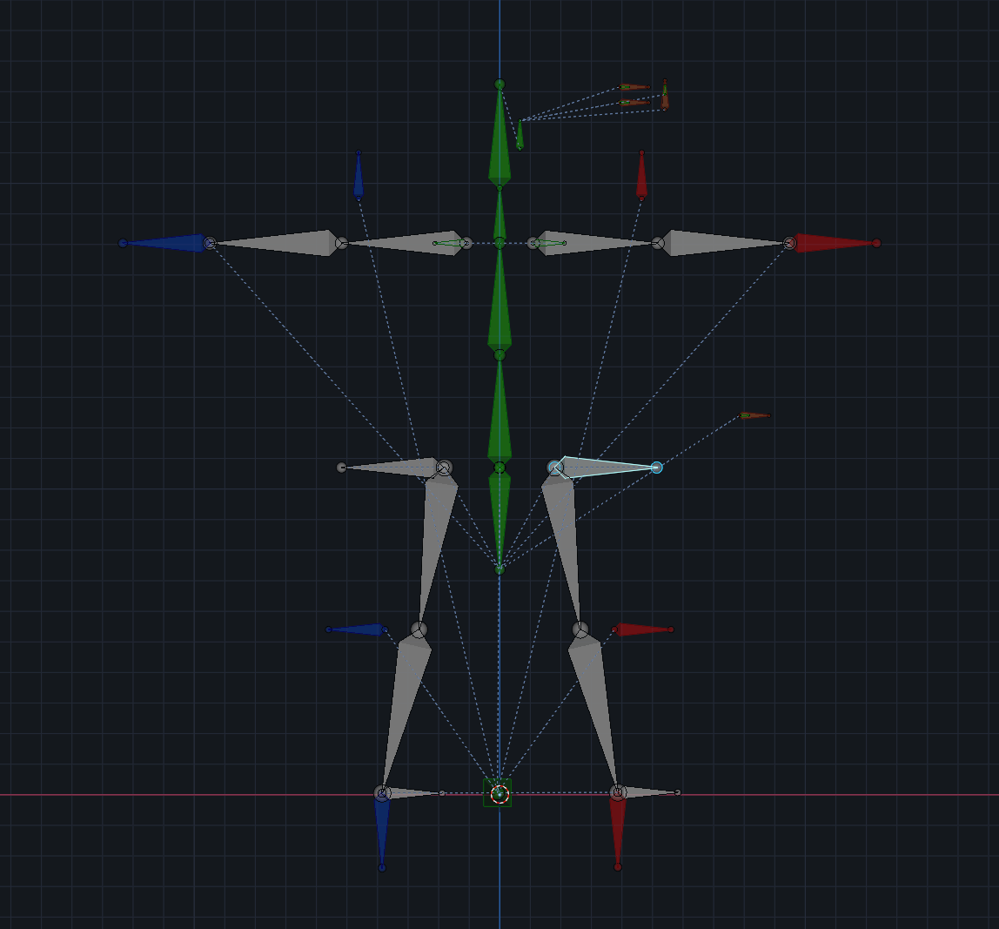
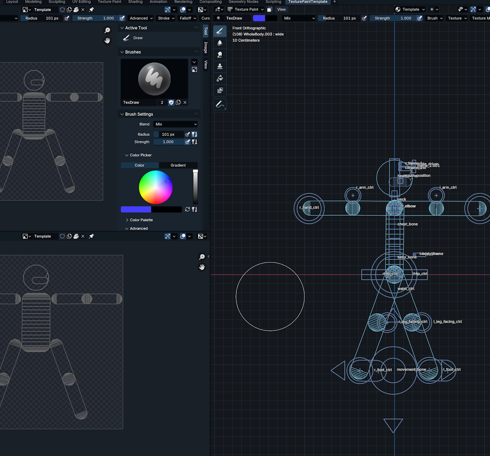
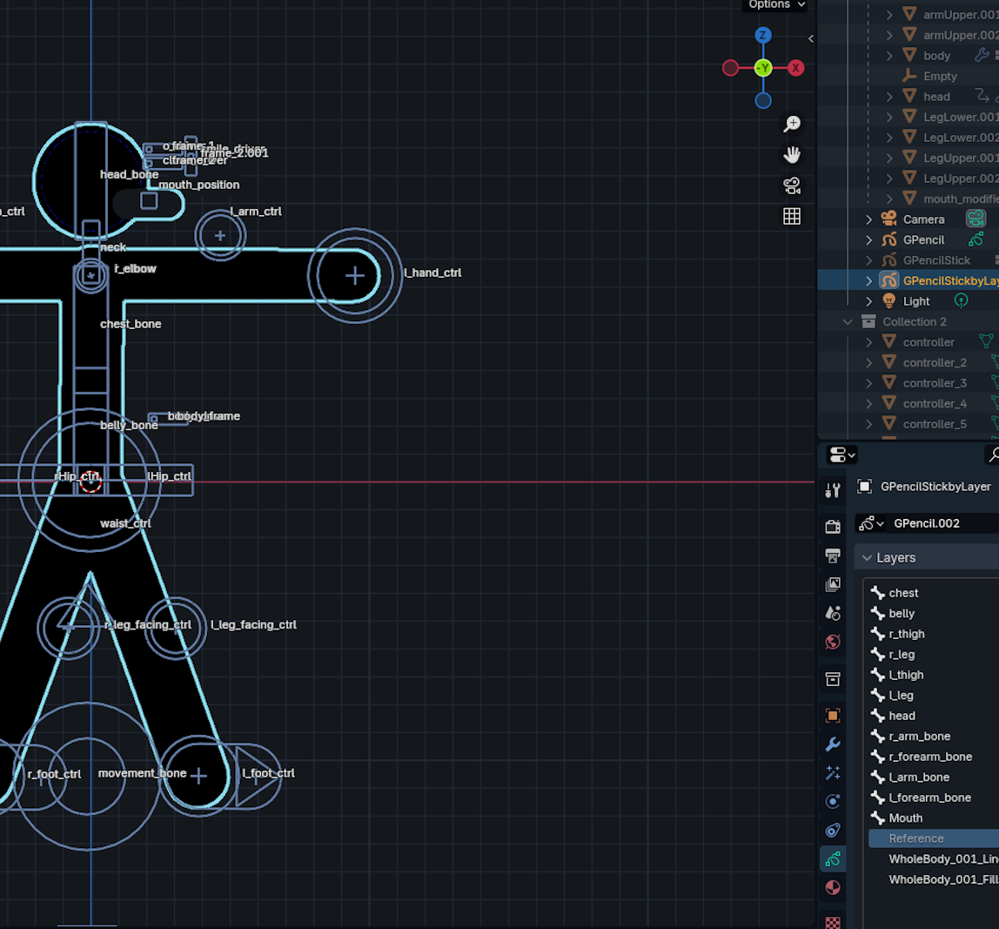
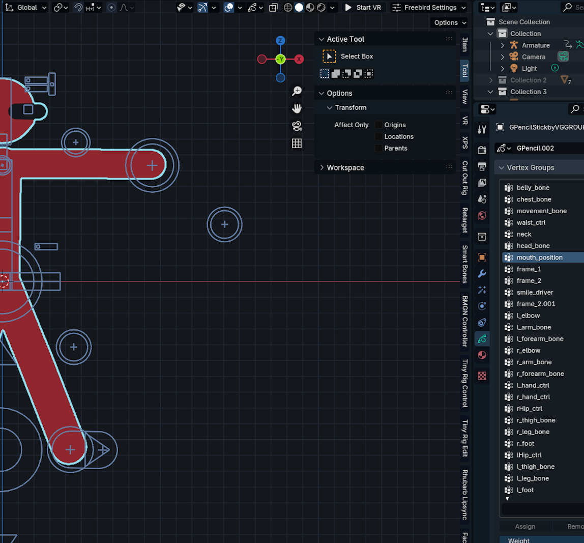

# 2D Stickman v4 Rig mods Grease Pencil

[CC BY 4.0](https://creativecommons.org/licenses/by/4.0/deed.en)

STILL WIP, but less likely to update (because author sucks at rigging) so feel free to download and/fork to try out.

This is a convert to Blender 4.2/modification of the 2D StickMan Rig v3 by [energiesgraphiques](https://blendswap.com/profile/40739) which was originally developed by [LDev](http://www.blendswap.com/user/LDev)

It has 4 file

- **BlackStickTemplate** is the stripped bare bone armature, useful for furthure modification
  
- **MeshTectureEditForTemplate** is the Mesh one, except the material has been setup for texture paint cutout
  
- **GPLayerLinkedTemplate** is grease pencil rig based on grease pencil layer relation
  
- **GPVertexGroupTemplate** is grease pencil rig based on Vertex Group
  

Current issues:

- Foot has unwanted quaterion?

- Mouth RIg for Grease Pencil version is not done

- Origin of character rig is not standard

- No neck (?)

Enhancement

- No ik/fk switch

- no option for stretchy arm

Original File (need to login to blendswap)

2D Stickman V3 by energiesgraphiques

2D Stickman V2 by LDev

Original Files:
[2D Stickman rig v2 by Ldev](https://blendswap.com/blend/15217)
[2D Stickman rig v3 by energiesgraphiques](https://blendswap.com/blend/16158)
